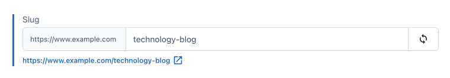

# Contentful Better Slugs App

Contentful offers the functionality to automatically generate slugs based on a pre-defined field, which works well for most situations.
However, it lacks some additional features, such as the ability to source the slug from multiple fields using a slug pattern instead of a single pre-defined field.
This app aims to enhance slug generation by providing more flexibility through configuration and improving the user experience.

The App is an evolution of the now deprecated [Contentful Better Slugs UI Extension](https://github.com/pauloamgomes/contentful-better-slugs).
It supports most major languages and utilizes the slugify library [https://github.com/sindresorhus/slugify](https://github.com/sindresorhus/slugify) under the hood.

Check below for a screencast showing it in action:

## 🛠 Setup

Install the App using by doing the below steps:

1. Create a new Contentful custom App and define the Application Name (e.g. Better Slugs)

2. Download this repo and drag the dist folder into the Bundles upload zone:

You can find more details about hosting an [Contentful app here](https://www.contentful.com/developers/docs/extensibility/app-framework/hosting-an-app/)

3. Set the App configuration screen and Field locations (Short text only):

4. Create two instance parameters

- Help Text: Type `Text`, Display name `Help text`, and id `helpText`
- Override Show Website Url: Type: `Boolean`, Display name `Show website url`, id `showWebsiteUrl`, Default value: `true`
- Override Show Preview Url: Type `Boolean`, Display name `Show preview url`, id `showPreviewUrl`, Default value: `true`

exactly as per below screenshot:

5. Save, and Install the App in your space, you'll see the configuration screen:

Configure the options you want (check the configuration section further below in this document)

6. Go to the Content Model definitions and set the Better Slugs app in the Appearance tab:

7. Open an entry of the configured content model and confirm the Slug input appears according to the values defined in the App Configuration.

Depending on what you configured you can have different elements on the field, for example if configured to show website domain:

If field supports localization it will render on each locale as per localized slug pattern:

## ⚙️ App Configuration

The App Configuration provides 4 main settings:

### General Settings

- Website URL : It will be used to generate an handy preview link for you slug.
- Custom Char Replacements : Provides the ability to define custom replacements, for example "&" being replaced with "at", or using emojis.
- Show Copy Button : If enabled renders a "copy slug to clipboard" button.
- Show Website URL : If enabled renders the slug with the website domain prefixed
- Show Preview Link : If enabled renders below the slug input field an hyperlink (opens in a new window) that is the result of the slug value combined with the site url.
- Lock when published : If enabled, and the entry is in Published state the slug will not automatically update (the user can click on the reset button).
- Maintain case : If enabled, the slug text will not be automatically converted to lowercase, maintaing the values of the source fields.
- Preserve Leading Underscore : If enabled, a leading underscore will not be removed from the slug value.
- Preserve certain characters : The ability to specify a list of special chars that will not be replaced.

### Create Better Slugs Configuration

In this screen you can select a content model and a field to be used as slug and set the pattern to generate the slug.

When creating a "slug pattern" it's possible to use replacement tokens from a list that is dynamically generated depending on the content model.
Some tokens are global:

- year : renders current year, e.g. 2023
- month : renders current month, e.g. 06
- day : renders current day, e.g. 10
- id : renders entry id
- locale : renders locale using the configured mappings

Along with the global tokens, specific content model tokens will be displayed, basically all fields that are of type Short Text, Date or Link (single reference).
For Link fields it will get from the entry reference all fields of type Short Text and Date.

### Better Slugs Configurations

In this screen you can see all definitions and delete or update the slug patterns.

### Locale Path Mappings

If localization is in use, and the `[locale]` token is present in one of the patterns, it's possible to map contentful locales to path values,
for example `en-US` to "" or "`en`" depending on your needs.

## 🥷 Development

Clone this Repo and install dependencies `pnpm install`

In the project directory, you can run:

#### `pnpm run start`

Creates or updates your app definition in Contentful, and runs the app in development mode.
Open your app to view it in the browser.

The page will reload if you make edits.
You will also see any lint errors in the console.

#### `pnpm run build`

Builds the app for production to the `dist` folder.
It correctly bundles React in production mode and optimizes the build for the best performance.

The build is minified and the filenames include the hashes.
Your app is ready to be deployed!

#### `pnpm run upload`

Uploads the `dist` folder to Contentful and creates a bundle that is automatically activated.
The command guides you through the deployment process and asks for all required arguments.
Read [here](https://www.contentful.com/developers/docs/extensibility/app-framework/create-contentful-app/#deploy-with-contentful) for more information about the deployment process.

#### `pnpm run upload-ci`

Similar to `npm run upload` it will upload your app to contentful and activate it. The only difference is
that with this command all required arguments are read from the environment variables, for example when you add
the upload command to your CI pipeline.

For this command to work, the following environment variables must be set:

- `CONTENTFUL_ORG_ID` - The ID of your organization
- `CONTENTFUL_APP_DEF_ID` - The ID of the app to which to add the bundle
- `CONTENTFUL_ACCESS_TOKEN` - A personal [access token](https://www.contentful.com/developers/docs/references/content-management-api/#/reference/personal-access-tokens)

## Learn More

This project was bootstrapped with [Create Contentful App](https://github.com/contentful/create-contentful-app), but using pnpm as package manager.

## Copyright and license

Copyright 2023 pauloamgomes under the MIT license.
